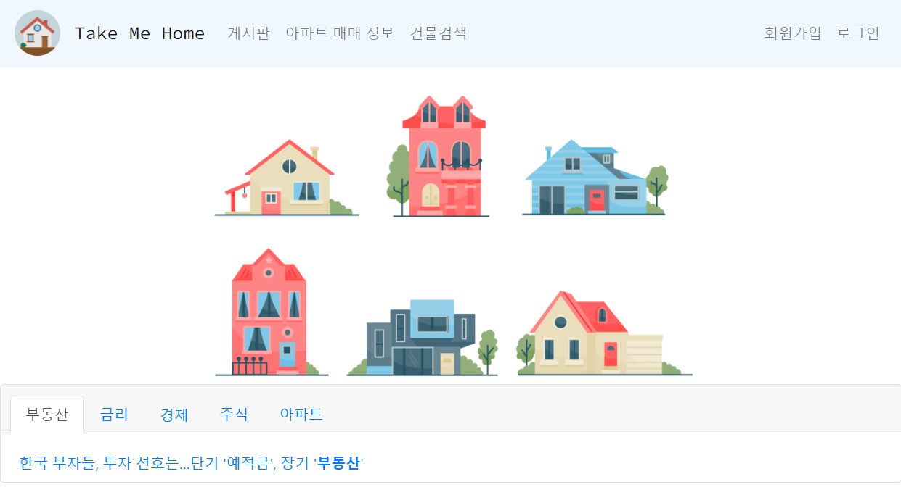
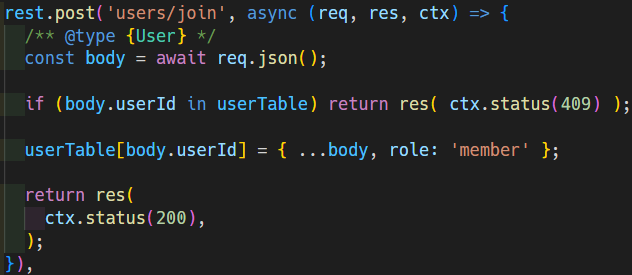
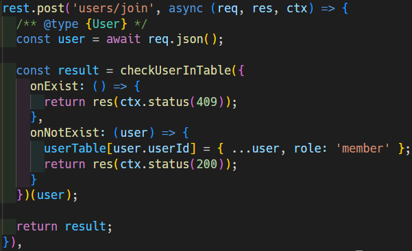

# Take Me Home


## WIP

- [ ] mock server API

Let the web page works without back-end API.

Use [MSW](https://mswjs.io/) to intercept the API calls.

- [ ] refactoring

Make code declarative.

before



after



## Project setup
```
npm install
```

### Compiles and hot-reloads for development
```
npm run serve
```

### Compiles and minifies for production
```
npm run build
```

### Customize configuration
See [Configuration Reference](https://cli.vuejs.org/config/).
