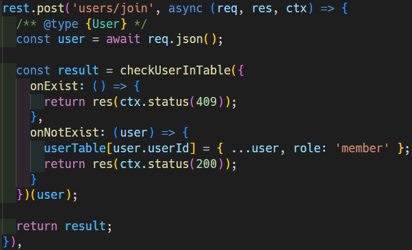

# Take Me Home


## WIP

- [ ] mock server API

Let the web page works without back-end API.

Use [MSW](https://mswjs.io/) to intercept the API calls.

- [ ] refactoring

Make code declarative.

before


after



- [ ] Follow [Functional Core, Imperative Shell Pattern](https://github.com/kbilsted/Functional-core-imperative-shell)(FCIS)

### Why FCIS?

I love functional programming and it's idea but it's so hard to make some 'real' application.

Look at this example.

```js

// src/mocks/handle-api/auth.js

/**
 * @typedef {Object<string, User>} UserTable
 */

// this is a mocked repository

/** @type {UserTable} */
const userTable = {};

// sign up scenario
// executed when client try to register id which is not in the userTable
const onUserNotExist = (user) => (req, res, ctx) => {
  userTable[user.userId] = { ...user, role: 'member' }; // <- SIDE EFFECT!
  return res(ctx.status(200));
};

```

You can see a side effect occurs in `onUserNotExist` function.

It makes **hard to predic** what's in `userTable`.

When the function receives `{userId: 'james'}` as an argument and is executed,

`userTable` can be `{'james': {userId: 'james'}}`, `{'amy': {userId: 'amy'}, 'james': {userId: 'james'}}` and so on.

On top of that, It's **hard to test**.

To test the function, we have to export `userTable`.

```js
// src/mocks/handle-api/auth.js

/** @type {UserTable} */
export const userTable = {};
```

```js
// src/mocks/handle-api/auth.test.js

import {userTable} from './auth.js';

it('register account into userTable', () => {
    onUserNotExist({userId: 'james'})();
    expect(userTable).toEqual({'james': {userId: 'james'}});
});
```

It looks ok until no other test cases refer the `userTable`.

```js
// src/mocks/handle-api/auth.test.js

import {userTable} from './auth.js';

it('registers account into userTable', () => {
    onUserNotExist({userId: 'james'})();
    expect(userTable).toEqual({'james': {userId: 'james'}});
});

...

it('drops account out', () => {
    dropOut({userId: 'amy'});
    // what we can expect here?
});
```

We can't expect anything to the last test case.

`userTable` can be empty object if 'james' dropped out already.

Then how can we make it testable?

### Dependency Injection

We can reduce side effect by using Dependency Injection(DI).

DI in functional programming is just giving dependencies as argument to function.

Let's refactor `onUserNotExist` function.

```js
// src/mocks/handle-api/auth.core.js

export const registerUser = (userTable) => (user) => {
    // local mutation
    // function itself is pure yet
    let newUserTable = {...userTable};
    newUserTable[user.userId] = { ...user, role: 'member' };
    return newUserTable;
};
```
> **Note** \
> I've named the file auth.**core**.js. \
> I'll insert a keyword 'core' into every file which contains pure functions so that follow FCIS.

Here's a pure function `registerUser`.

This function is predictable and testable.

So we can write a test on it.

```js
// src/mocks/handle-api/auth.test.js

import {registerUser} from './auth.core.js';

it("register user account on table", () => {
    const table = {}, account = {userId: 'james'};
    const result = registerUser(table)(account);
    expect(result).toEqual({'james': {userId: 'james'}});
};
```

Hooray! everything is fine.

But this function is not useful until we inject the dependencies(i.e. arguments).

So let's inject dependency to the function!

```js
// src/mocks/handle-api/auth.container.js

import {registerUser} from './auth.core.js';

const userTable = {}; // this reference will be shared among CRUD operations

// here dependency injected
export const registerUserOnTable = registerUser(userTable);
```

> **Note** \
> I've named the file auth.**container**.js. \
> container means that DI made here.

Now use this function in the SHELL.

```js
// src/mocks/handle-api/auth.js

import {registerUserOnTable} from './auth.container.js';

const onUserNotExist = (user) => (req, res, ctx) => {
  registerUserOnTable(user)
  return res(ctx.status(200));
};
```

### Conclusions

With FCIS + DI, we can integrate FP's lessons with Imperative world.

We can ensure that every functional core part works fine by testing.

When unexpected effect is occured, we'll just investigate imperative shell part since functional core have been tested.


[ References ]

[Mutation isn't always bad in JavaScript](https://dev.to/nas5w/mutation-isnt-always-bad-in-javascript-5e94) by Nick Scialli

[Functional Programming Trick: How to Mutate State While Preserving Referential Transparency](https://betterprogramming.pub/your-code-should-read-like-a-story-how-to-mutate-state-and-have-effect-on-the-world-while-3e3ae808d2d6) by Ivelina Yordanova


## Project setup
```
npm install
```

### Compiles and hot-reloads for development
```
npm run serve
```

### Compiles and minifies for production
```
npm run build
```

### Customize configuration
See [Configuration Reference](https://cli.vuejs.org/config/).
